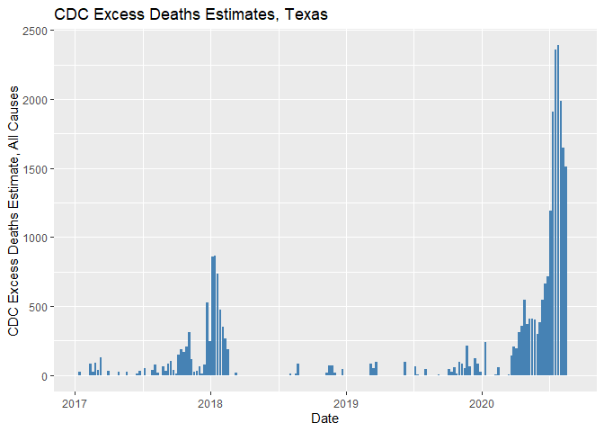
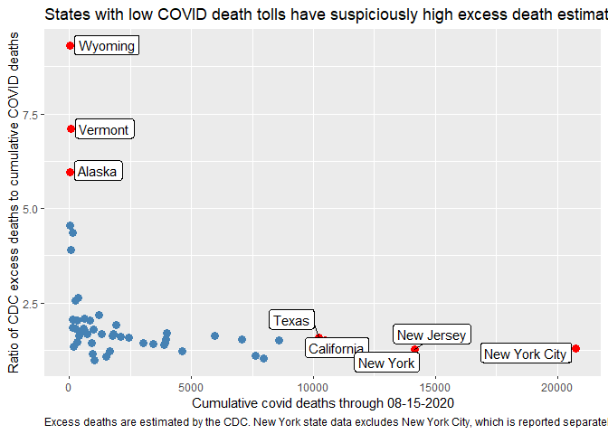

With the COVID-19 pandemic raging for roughly half a year now,
numerous institutions have worked together to make daily, state-level
data on cases and deaths available to the public. Among the many useful
tools that are easily accessed include JHU’s coronavirus dashboard and
Worldometer’s COVID tracker. As impressive as these efforts have been,
the data available only paint part of the picture. The issue with cases
is intuitive: people are less likely to get a test if they don’t feel
sick (even if they really are carrying the virus), so reported cases
likely underestimate the true value. The issue with deaths is both more
important to understand and more complicated: there are competing
sources of causes behind any death: complications due to COVID, causes
excluding COVID, and causes that are indirectly influenced by CinslOVID
(e.g. forgoing a heart surgery to avoid the hospital/due to lack of
insurance because of a job layoff and then suffering a cardiac arrest).

### Putting excess deaths measures in context

It can be hard to interpret excess deaths totals by themselves. If we
let *E**i* and *D**i* denote the number cumulative
number of excess (non-COVID) and observed (COVID) deaths, then the ratio
$\\frac{E\_i}{D\_i}$ gives us a sense of how large that state’s count of
excess deaths is relative to its count of COVID deaths. For states with

### Working with the CDC excess deaths data

The CDC’s excess deaths data is readily available to download, along
with a
[page](https://www.cdc.gov/nchs/nvss/vsrr/covid19/excess_deaths.htm)
outlining their methodology. In the code below, I pull the data directly
from the CDC’s API and start cleaning it

    # Load in main data
    datalink = 'https://data.cdc.gov/api/views/xkkf-xrst/rows.csv?accessType=DOWNLOAD&bom=true&format=true%20target='
    data<-read.csv(datalink,sep=',')

    # Data for all deaths 
    data_all<-data[data$Outcome == 'All causes',]
    data_all<-data_all[data_all$Type != 'Unweighted',]

    colnames(data_all)[1] <- 'date' # correct character issue in data var

For context, it makes sense to examine “typical” trends in excess deaths
measures for a couple states:

    ggplot(data=data_all[data_all$State=='Massachusetts',],
            aes(y=Excess.Higher.Estimate,x=as.Date(date))) +
            geom_bar(stat='identity', fill='steelblue') +
            xlab("Date") + ylab("CDC Excess Deaths Estimate, All Causes") + 
            ggtitle("CDC Excess Deaths Estimates, Massachusetts")

    ggplot(data=data_all[data_all$State=='Texas',],
            aes(y=Excess.Higher.Estimate,x=as.Date(date))) +
            geom_bar(stat='identity', fill='steelblue') +
            xlab("Date") + ylab("CDC Excess Deaths Estimate, All Causes") + 
            ggtitle("CDC Excess Deaths Estimates, Texas")

It’s useful to consider both cross-sectional and dynamic features of the
data. One metric to consider is the cumulative number of deaths within
each state through the present, as this gives us a sense of how serious
of a toll the virus has had on each state.

    # Keep data from the start of 2020 onward
    data<-data[as.Date(data[,1])>=as.Date('2020-01-01'),]
    data_all<-data_all[as.Date(data_all$date)>=as.Date('2020-01-01'),]

    # Data for all deaths excluding covid
    data_ex_covid<-data[data$Outcome == 'All causes, excluding COVID-19',]

    # Create running sums of deaths and excess deaths
    covid_deaths<-data_all$Observed.Number - data_ex_covid$Observed.Number
    data_all$cum_covid_deaths <- ave(covid_deaths,data_all$State,FUN=cumsum)
    data_all$cum_excess <- ave(data_all$Excess.Higher.Estimate,data_all$State,FUN=cumsum)
    data_all$excess_ratio <- data_all$cum_excess/data_all$cum_covid_deaths

    # 
    deaths_curr <- data_all[as.Date(data_all$date)==as.Date('2020-08-015'),]
    deaths_curr <- deaths_curr[deaths_curr$State != 'United States',]
    deaths_curr <- deaths_curr[!is.na(deaths_curr$excess_ratio),]

Now, we can plot each state’s excess death ratio against its cumulative
COVID death count to get a sense of

    # Partition data to label only a subset of points
    deaths_curr_label <- deaths_curr[deaths_curr$cum_covid_deaths>10000 | deaths_curr$excess_ratio>5,]
    deaths_curr_nolabel <- deaths_curr[deaths_curr$cum_covid_deaths<=10000 & deaths_curr$excess_ratio<=5,]

    ggplot(deaths_curr_label, aes(x=cum_covid_deaths,y=excess_ratio)) + 
           geom_point(size=3,alpha=1,color='red') +
           geom_label_repel(aes(label=State)) +
           geom_point(data = deaths_curr_nolabel, color='steelblue',size=3,alpha=1) +
           ggtitle('States with low COVID death tolls have suspiciously high excess death estimates') +
           xlab('Cumulative covid deaths through 08-15-2020') +
           ylab('Ratio of CDC excess deaths to cumulative COVID deaths') +
           labs(caption = 'Excess deaths are estimated by the CDC. New York state data excludes New York City, which is reported separately.') +
           theme(plot.caption = element_text(hjust=0))

