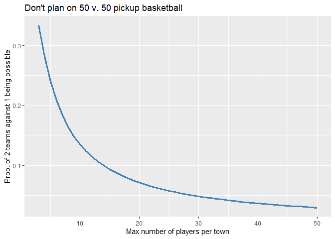
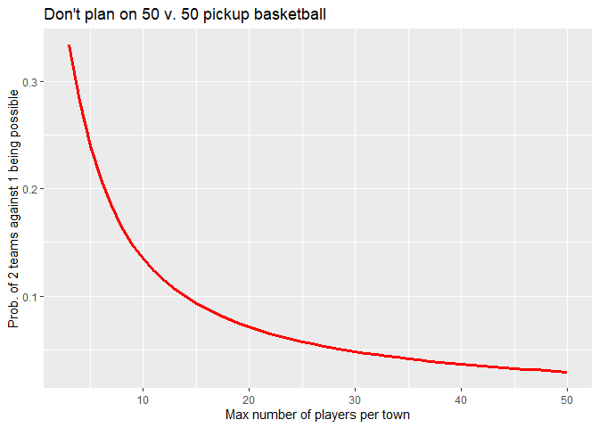

This week’s Riddler Express was a made with playoff basketball in mind
(as well as last-minute GRE season):

> Once a week, folks from Blacksburg, Greensboro, and Silver Spring get
> together for a game of pickup basketball. Every week, anywhere from
> one to five individuals will show up from each town, with each outcome
> equally likely.

> Using all the players that show up, they want to create exactly two
> teams of equal size. Being a prideful bunch, everyone wears a jersey
> that matches the color mentioned in the name of their city. However,
> since it might create confusion to have one jersey playing for both
> sides, they agree that the residents of two towns will combine forces
> to play against the third town’s residents.

> What is the probability that, on any given week, it’s possible to form
> two equal teams with everyone playing, where two towns are pitted
> against the third?

We can look at this specific case first, before looking at the general
case where up to *n* players can show up from each town (which is the
extra credit portion of the problem).

It makes sense to fix a pair of towns as a team (let’s say A and B) and
look at what combinations of players are feasible (i.e. at most 5).
Since there will only be one way for the number of players on team C to
match the number of players on teams A and B for a fixed combination,
the total number of feasible combinations will be exactly the total
number of cases where we can form equal teams of A and B vs C. It’s easy
enough to look at this in a table, enumerating the possible number of
players from teams A and B by the table’s rows and columns,
respectively, and letting each entry denote the corresponding sum for
the row and column. Feasible cases are those that are at most 5:
$$
\\begin{bmatrix}
2 & 3 & 4 & 5 & . \\\\
3 & 4 & 5 & . & . \\\\
4 & 5 & . & . &  . \\\\ 
5 & . & . & . &.  \\\\
 .&.  & . &.  & .
\\end{bmatrix}
$$
This gives us 10 feasible combinations between towns A and B, so in turn
there are 30 in total given that there are $3\\choose2$  = 3 possible
ways to pair towns. That implies that there’s a
$\\frac{30}{5^3} = \\frac{6}{25}$ probability of being able to pit 2
towns against 1 on any given week. Just to be sure, we can check that we
get the same result through simulations:

We see that the results match.

### General case

Looking at the table above, we can see that there are $\\frac{n^2-n}{2}$
feasible combinations for each possible town pairing, which implies the
overall probability is
$$
3 \\frac{\\left(\\frac{n^2-n}{2}\\right)}{n^3} 
$$
We can plot this over *n*:

    # Compute probability from small pickup games to preposterously large ones
    n <- 3:50
    pi <- rep(NaN,length(n))
    for (i in 3:max(n)) {
      pi[i-2] <- 3 * (0.5*(i^2 - i))/(i^3)
    }

Source code for this post can be found
[here](https://github.com/kbarnatchez/kbarnatchez/tree/master/content/post/2020-09-12-riddler).

